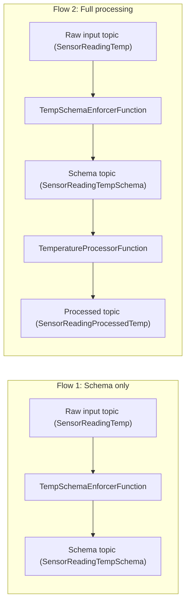

# PulsarFunction

Java-based Apache Pulsar Functions project for processing temperature sensor events in two stages:

1. Enforce and enrich incoming message schema with a broker publish timestamp.
2. Convert Fahrenheit temperature values to Celsius and add a processing timestamp.

## Project Overview

This project defines two Pulsar Functions that can be used as separate flows.

### Flow 1: Input -> Schema Message

Function: `TempSchemaEnforcerFunction`

- Input type: `SensorReadingTemp`
- Output type: `SensorReadingTempSchema`
- Purpose:
  - Standardize the message shape before further processing.
  - Add `pulsar_timestamp` using the Pulsar publish time from message metadata.

Flow:

`input message` -> `schema message`

### Flow 2: Input -> Schema Message -> Processed Message

Functions:

1. `TempSchemaEnforcerFunction`
2. `TemperatureProcessorFunction`

`TemperatureProcessorFunction` details:

- Input type: `SensorReadingTempSchema`
- Output type: `SensorReadingProcessedTemp`
- Purpose:
  - Keep the original Fahrenheit value.
  - Compute Celsius value in `updated_temperature_celsius`.
  - Add `processed_timestamp` in UTC format.

Flow:

`input message` -> `schema message` -> `processed message`

Functions are under `src/main/java/org/example`, and schema classes are under `src/main/java/org/example/schema`.

## Schemas (JSON)

### Input Schema (`SensorReadingTemp`)

```json
{
  "message_id": "string",
  "temperature": 0.0,
  "timestamp": "yyyy-MM-dd'T'HH:mm:ss.SSSSSSSSS",
  "payload": "string"
}
```

### Schema Message (`SensorReadingTempSchema`)

```json
{
  "message_id": "string",
  "temperature": 0.0,
  "timestamp": "yyyy-MM-dd'T'HH:mm:ss.SSSSSSSSS",
  "pulsar_timestamp": "yyyy-MM-dd'T'HH:mm:ss.SSSSSSSSS",
  "payload": "string"
}
```

### Processed Schema (`SensorReadingProcessedTemp`)

```json
{
  "message_id": "string",
  "temperature_fahrenheit": 0.0,
  "updated_temperature_celsius": 0.0,
  "produced_timestamp": "yyyy-MM-dd'T'HH:mm:ss.SSSSSSSSS",
  "processed_timestamp": "yyyy-MM-dd'T'HH:mm:ss.SSSSSSSSS",
  "pulsar_timestamp": "yyyy-MM-dd'T'HH:mm:ss.SSSSSSSSS",
  "payload": "string"
}
```

## Processing Flows

### Flow 1 (Schema only)

Raw input topic -> `TempSchemaEnforcerFunction` -> schema topic

### Flow 2 (Full processing)

Raw input topic -> `TempSchemaEnforcerFunction` -> schema topic -> `TemperatureProcessorFunction` -> processed topic

### Flowchart




## Prerequisites

- Java 17+
- Maven 3.8+
- Apache Pulsar cluster with Pulsar Functions enabled

## Build

```bash
mvn clean package
```

The build uses `maven-shade-plugin` to package dependencies into a deployable jar in `target/`.

## Example Deployment

Update topic names, tenant/namespace, broker URL, and jar path for your environment.

### Deploy schema enforcer

```bash
pulsar-admin functions create \
  --tenant public \
  --namespace default \
  --name temp-schema-enforcer \
  --jar target/PulsarFunction-1.0-SNAPSHOT.jar \
  --classname org.example.TempSchemaEnforcerFunction \
  --inputs persistent://public/default/temp \
  --output persistent://public/default/temp_schema
```

### Deploy temperature processor

```bash
pulsar-admin functions create \
  --tenant public \
  --namespace default \
  --name temperature-processor \
  --jar target/PulsarFunction-1.0-SNAPSHOT.jar \
  --classname org.example.TemperatureProcessorFunction \
  --inputs persistent://public/default/temp_schema \
  --output persistent://public/default/processed_temp
```

## Flow Examples

### Flow 1 Example (`input message` -> `schema message`)

Input message (`SensorReadingTemp`):

```json
{
  "message_id": "m-1001",
  "temperature": 77.0,
  "timestamp": "2026-03-15T11:45:12.123456789",
  "payload": "sensor=A12"
}
```

Schema message output (`SensorReadingTempSchema`):

```json
{
  "message_id": "m-1001",
  "temperature": 77.0,
  "timestamp": "2026-03-15T11:45:12.123456789",
  "pulsar_timestamp": "2026-03-15T11:45:12.900000000",
  "payload": "sensor=A12"
}
```

### Flow 2 Example (`input message` -> `schema message` -> `processed message`)

Input message (`SensorReadingTemp`):

```json
{
  "message_id": "m-1001",
  "temperature": 77.0,
  "timestamp": "2026-03-15T11:45:12.123456789",
  "payload": "sensor=A12"
}
```

Schema message (intermediate, `SensorReadingTempSchema`):

```json
{
  "message_id": "m-1001",
  "temperature": 77.0,
  "timestamp": "2026-03-15T11:45:12.123456789",
  "pulsar_timestamp": "2026-03-15T11:45:12.900000000",
  "payload": "sensor=A12"
}
```

Processed message output (`SensorReadingProcessedTemp`):

```json
{
  "message_id": "m-1001",
  "temperature_fahrenheit": 77.0,
  "updated_temperature_celsius": 25.0,
  "produced_timestamp": "2026-03-15T11:45:12.123456789",
  "processed_timestamp": "2026-03-15T11:45:13.004500000",
  "pulsar_timestamp": "2026-03-15T11:45:12.900000000",
  "payload": "sensor=A12"
}
```

## Notes

- Both functions return `null` when input is `null`.
- Timestamps generated by functions are UTC-based and nanosecond-formatted strings.
- Maven configuration is defined in `pom.xml` with Pulsar Functions API `4.0.0`.

